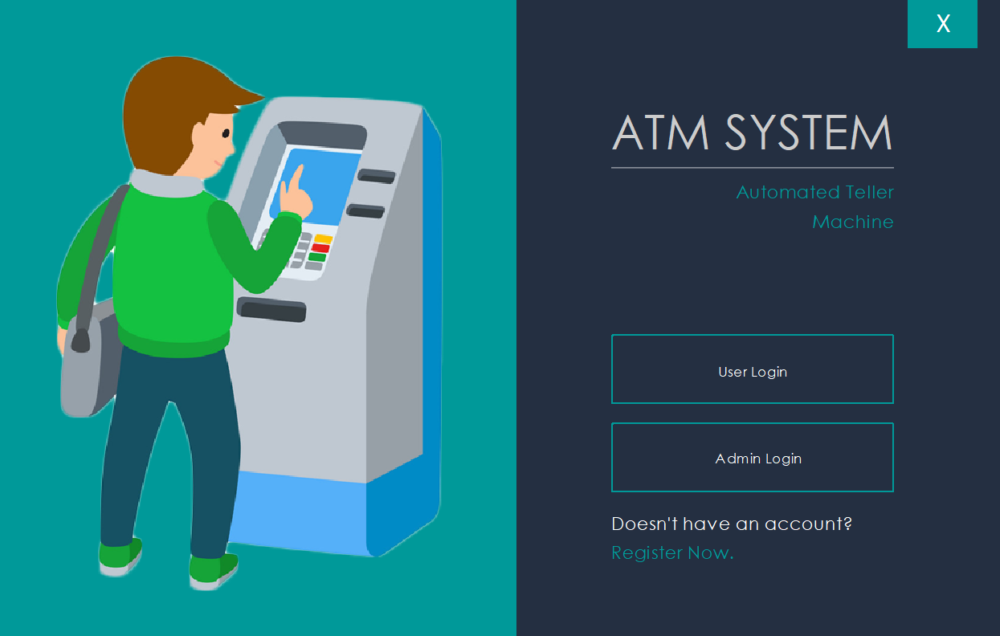

# 🏧 Java ATM Simulator with Arrays 🏧

This Java-based ATM Simulator project is a console application that emulates the functionality of an Automated Teller Machine (ATM). The program allows users to perform basic banking operations, including checking their balance, making withdrawals, and depositing funds.

## ⭐️ Key Features

- 👤 Account Management: Users can create multiple accounts, each with a unique account number and PIN for secure access.
- 💰 Balance Inquiry: Users can check their account balance at any time to view their available funds.
- 💸 Cash Withdrawal: Account holders can withdraw money from their balance, and the program ensures that the withdrawal amount does not exceed the available balance.
- 💳 Cash Deposit: Users can deposit funds into their accounts, and the updated balance is reflected instantly.
- 🔒 Secure PIN Verification: The system verifies the entered PIN before granting access to the account for enhanced security.
- ❗️ Error Handling: The application handles various input errors gracefully, providing informative messages to users.

## 🚀 Getting Started

To run the ATM Simulator project, follow these steps:

1. Clone the repository to your local machine.
2. Compile the Java source files using your preferred IDE or command-line tool.
3. Run the compiled program and start simulating ATM operations.

## 🛠 Technology Stack

- 📦 Java: The core programming language used to implement the ATM Simulator.
- 📚 Arrays: The project exclusively employs arrays to store account data, transaction history, and other related information.

With its user-friendly interface and reliance on arrays for data storage, this Java ATM Simulator provides a practical and efficient way to simulate real-life banking operations. It serves as an educational tool to demonstrate Java programming concepts and data management using arrays in a simple and intuitive manner.

## 🤝 Contributing

Contributions, bug reports, and feature requests are welcome! Feel free to open an issue or submit a pull request.

🎉 Happy ATM Simulating! 🎉
